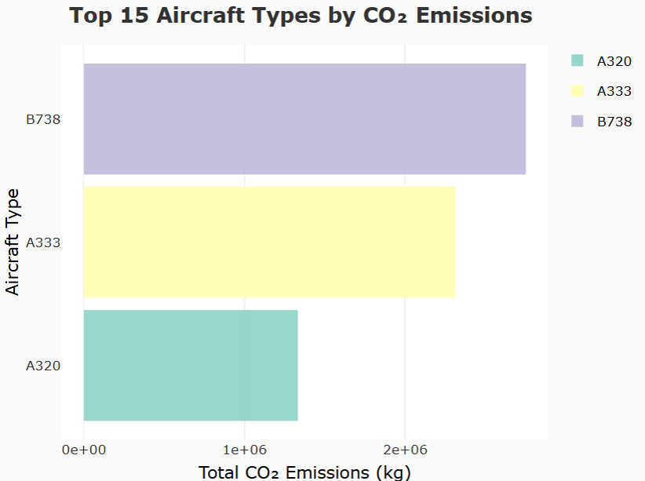
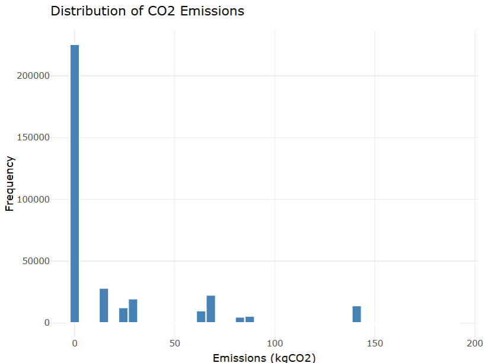
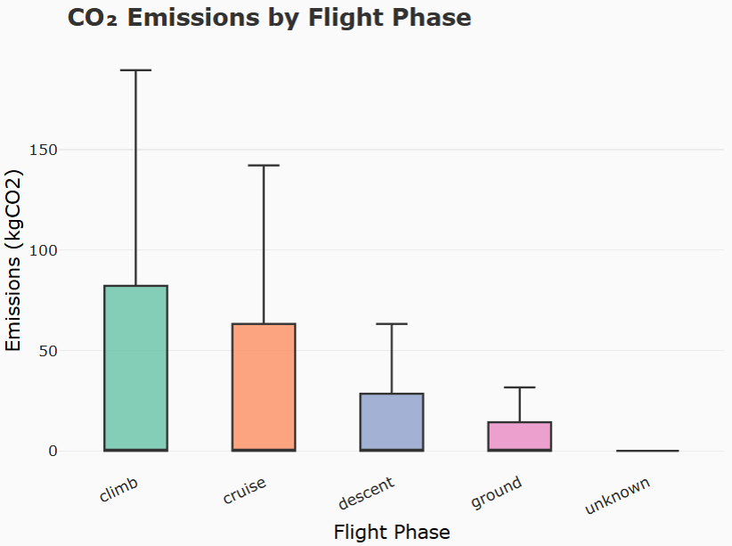
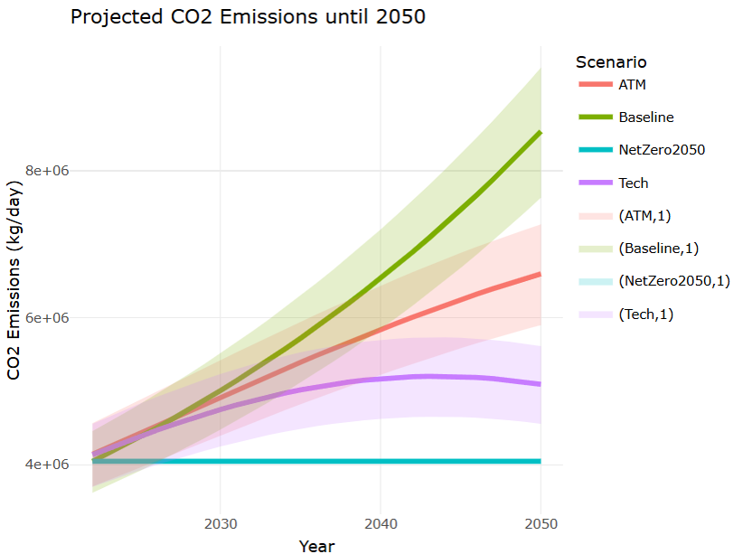
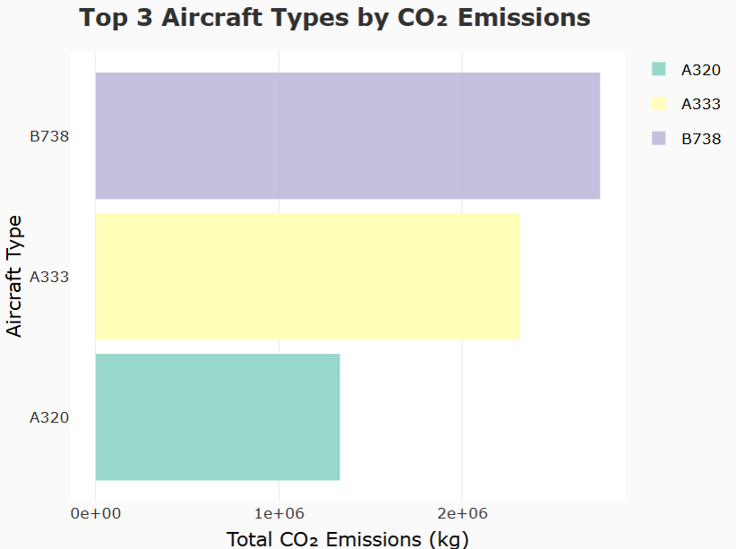

# ✈️ Ireland Aircraft CO₂ Emissions Analysis

> Analysis of aircraft CO₂ emissions over Irish airspace using real ADS-B flight tracking data from the OpenSky Network (June 2022).

Built with **R 4.5.1** as part of the **MS6071 – R for Data Science** module at the **University of Limerick**.

---

## 📌 Project Overview

This project processes raw ADS-B flight state data to estimate CO₂ emissions from aircraft flying over Ireland. It classifies flights by phase (climb, cruise, descent, ground), applies fuel flow models per aircraft type, and projects future emissions under multiple scenarios up to 2050.

**Key Questions Explored:**
- Which aircraft types produce the most CO₂ over Irish airspace?
- How do emissions vary across different flight phases?
- What does the future look like under different emission scenarios?

---

## 📊 Visualisations

### 🔹 Top Aircraft Types by CO₂ Emissions


The Boeing 737-800 (B738) is the highest CO₂ emitter over Irish airspace, followed by the Airbus A333 and A320.

---

### 🔹 Distribution of CO₂ Emissions


The majority of flight records show near-zero emissions, with a long tail indicating high-emission outliers — consistent with the ground phase dominating record counts.

---

### 🔹 CO₂ Emissions by Flight Phase


The **climb phase** produces the highest average CO₂ emissions (~85 kgCO₂), followed by cruise. Ground operations contribute the least.

---

### 🔹 Projected CO₂ Emissions Until 2050


Four scenarios are modelled from 2025 to 2050:
- 📈 **Baseline** — Emissions double by 2050 with traffic growth only
- 🔴 **ATM** — Air traffic management improvements slow growth
- 🟣 **Tech** — Technology efficiency improvements plateau emissions
- 🔵 **NetZero2050** — Flat emissions line meeting net-zero targets

---

### 🔹 Top 3 Aircraft Types by CO₂ Emissions


A focused view confirming B738, A333, and A320 as the dominant emitters in the dataset.

---

## 📁 Repository Structure

```
├── Project_airplane_R.R          # Main analysis script
├── Project_airplane_R_updated.R  # Updated/refined analysis
├── Updated_maps.R                # Spatial map visualisations
├── renv.lock                     # Reproducible package environment
├── renv/                         # renv environment folder
├── R_Project.Rproj               # RStudio project file
├── Rplot.png                     # Top 15 aircraft by CO₂
├── Rplot01.png                   # Emissions distribution
├── Rplot02.png                   # CO₂ by flight phase
├── Rplot03.png                   # Projected emissions to 2050
├── Rplot04.png                   # Top 3 aircraft by CO₂
└── README.md
```

> **Note:** Raw datasets (`Datasets/` folder with OpenSky CSV files) are excluded from this repository due to file size. See the Data Source section below to download them.

---

## 🛠️ Requirements

- **R version:** 4.5.1
- **IDE:** RStudio

### R Packages Used

| Package | Purpose |
|---|---|
| `tidyverse` | Data manipulation and visualisation |
| `ggplot2` | Static charts and plots |
| `plotly` | Interactive charts |
| `ggrepel` | Non-overlapping label positioning |
| `DT` | Interactive data tables |
| `readr` | Fast CSV file reading |
| `dplyr` | Data wrangling and transformation |
| `sf` | Spatial data for maps |
| `leaflet` | Interactive map visualisations |

---

## 🚀 Getting Started

### 1. Clone the repository
```bash
git clone https://github.com/Freston03/Ireland-Aircraft-CO-Emissions-Analysis.git
cd Ireland-Aircraft-CO-Emissions-Analysis
```

### 2. Open in RStudio
Open `R_Project.Rproj` in RStudio.

### 3. Restore packages
```r
renv::restore()
```

### 4. Add your dataset
Download the OpenSky Network data and place CSV files in a `Datasets/` folder:
```
Datasets/
├── aircraftDatabase.csv
├── states_2022-06-27-00.csv
├── states_2022-06-27-01.csv
├── ...
└── states_2022-06-27-23.csv
```

### 5. Update the file path
In `Project_airplane_R.R`, update the path to your dataset location:
```r
path <- "Datasets/"   # relative path from project root
```

### 6. Run the analysis
Open and run `Project_airplane_R.R` in RStudio.

---

## 📡 Data Source

- **Source:** [OpenSky Network](https://opensky-network.org/) — ADS-B flight state data
- **Date:** 27 June 2022 (hourly files: 00:00 – 23:00 UTC)
- **Area filtered:** Irish airspace (longitude: -11° to -5°, latitude: 51° to 56°)
- **Aircraft database:** OpenSky aircraft type and registration database

---

## 🔍 Methodology

1. **Data Loading** — 24 hourly ADS-B state CSV files are loaded and combined
2. **Filtering** — Records filtered to Irish airspace bounding box
3. **Flight Phase Classification** — Each record classified as climb, cruise, descent, or ground based on vertical rate and altitude
4. **Fuel Flow Estimation** — Fuel consumption estimated per aircraft type using ICAO BADA-style fuel flow coefficients
5. **CO₂ Calculation** — CO₂ emissions calculated using standard kerosene combustion factor (3.16 kg CO₂/kg fuel)
6. **Projection Modelling** — Future emissions projected to 2050 under 4 ICAO-aligned scenarios

---

## 👤 Author

**Freston** — MSc Postgraduate Student
University of Limerick, Ireland
Module: MS6071 – R for Data Science

[](https://github.com/Freston03)

---

## 📄 License

This project is for **academic purposes** as part of MS6071 – R for Data Science, University of Limerick.
Data sourced from the OpenSky Network under their academic use terms.
